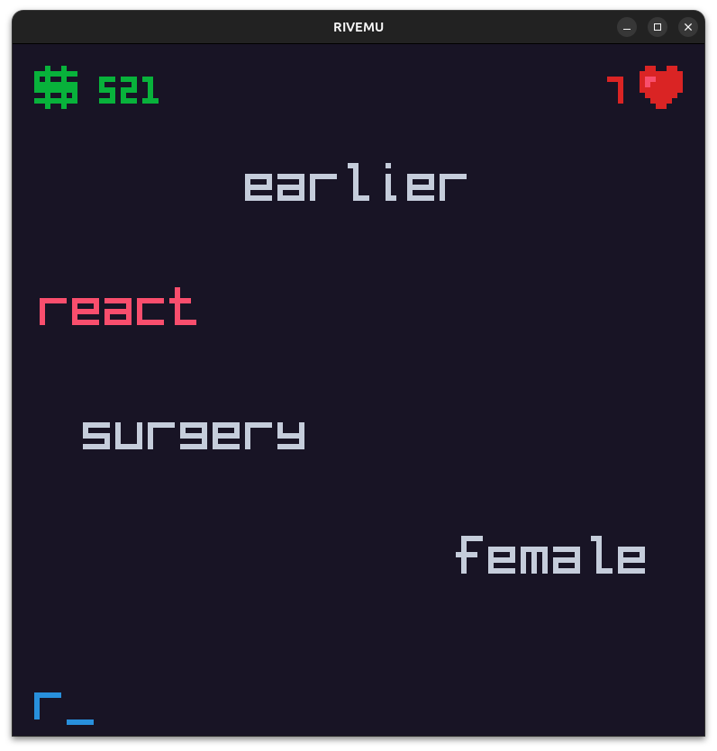

# Wordslide

A fun game to test your typing skills!

## Description

_Wordslide_ is a typing game developed for the [_RIV_ fantasy console](https://rives.io/).
Type the words that appear from the top of the screen before they reach the bottom!
You start with 10 _hearts_, and lose a heart whenever a word reaches the bottom.
The game ends when you run out of hearts.
You can win back a heart by typing a _healing word_, which is displayed in pink.
Your score is the number of correctly typed letters.

## Controls

- <kbd>A</kbd>, <kbd>B</kbd>, ..., <kbd>Z</kbd>: adds such letter to the typed word
- <kbd>Backspace</kbd>: deletes the last typed letter
- <kbd>Ctrl</kbd> + <kbd>Backspace</kbd>: deletes the whole typed word

## Downloading the cartridge

You can download the latest version of the cartrige from GitHub Releases [here](https://github.com/guidanoli/wordslide/releases/latest/download/wordslide.sqfs).

## Building the cartridge from source

Assuming you have RIVEMU and RIV SDK installed on your machine, you can build the cartridge from source by running the following command:

```sh
make build
```

This will generate a `wordslide.sqfs` file, which you can execute with `rivemu`.

## Dictionary

The `dictionary.txt` file is the original version
of the [2of5core](http://wordlist.aspell.net/12dicts-readme/#2of5core) list of words
from the [12Dicts](wordlist.aspell.net/12dicts) package version 6.0.2.
It is the smallest list from the package, containing about 4,700 words.
To simplify implementation and gameplay,
we filter out words from the original list
that contain hyphens, spaces, quotes, colons, or any other non-alphabetic character,
leaving around 4,500 words.
We have chosen the smallest list to improve runtime performance and overall cartridge size.
